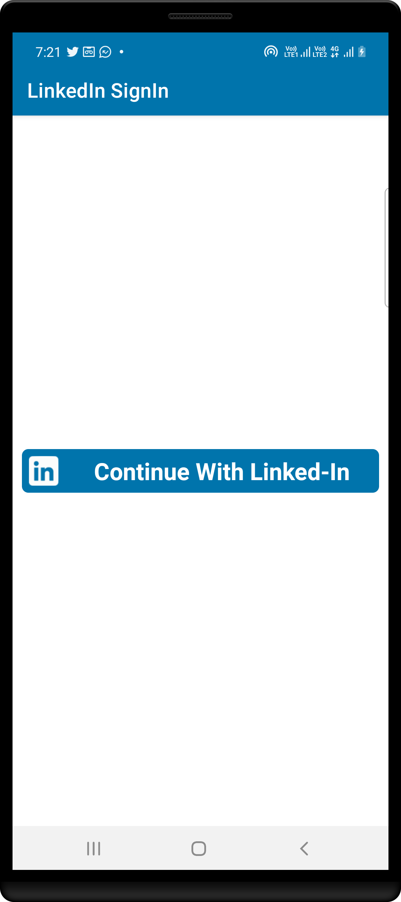
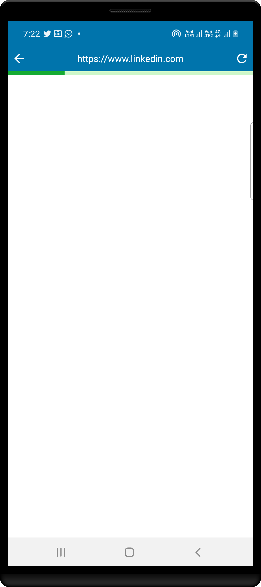
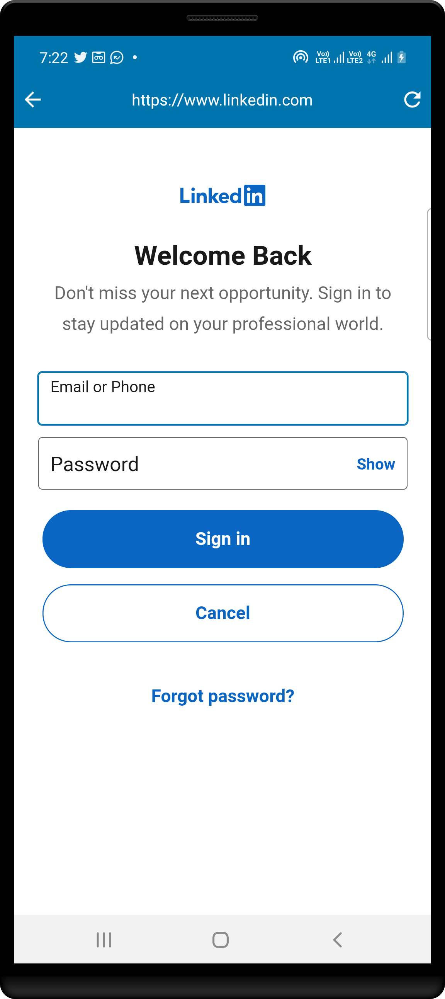
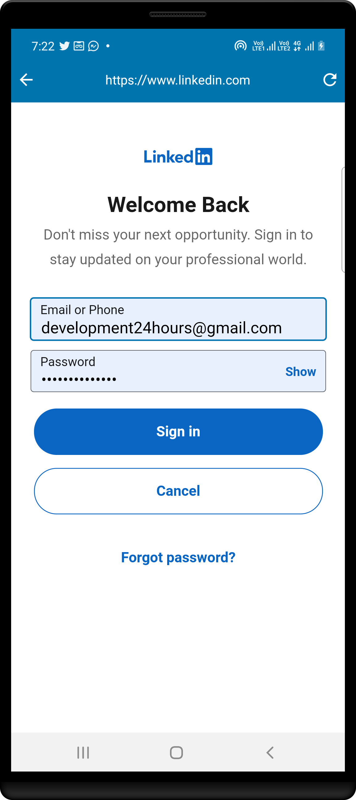

# JAVA - LinkedIn SignIn Made Easy

This code helps you to add LinkedIn Sign In option in your app with few lines of code.

Create App on LinkedIn Developer Console Click Here [**this link**](https://www.linkedin.com/developers/)

Let LinkedInSignIn support

- LinkedIn Sign-In
- Get user details :

name, firstName, lastName, photoUrl

|    First 1   |     First 2     |     First 3     |
|--------------|-----------------|-----------------|
|  |  |  |

|    First 4   |     First 5     |
|--------------|-----------------|
|  |  |
## Author ##

Rohit Yadav

[rohitnotes24@gmail.com](mailto:rohitnotes24@gmail.com)

[http://badasoftware.com/](http://badasoftware.com/)
